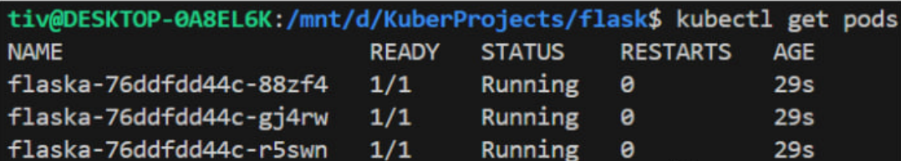
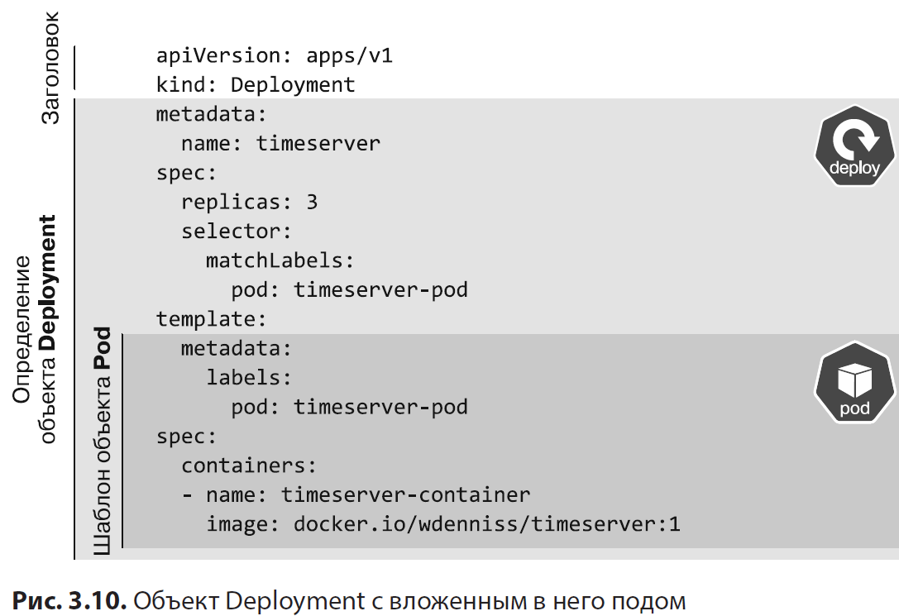
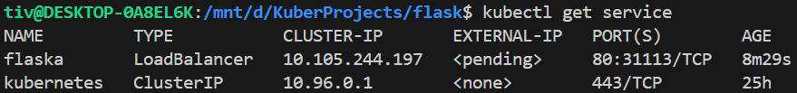
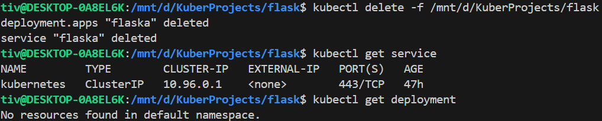
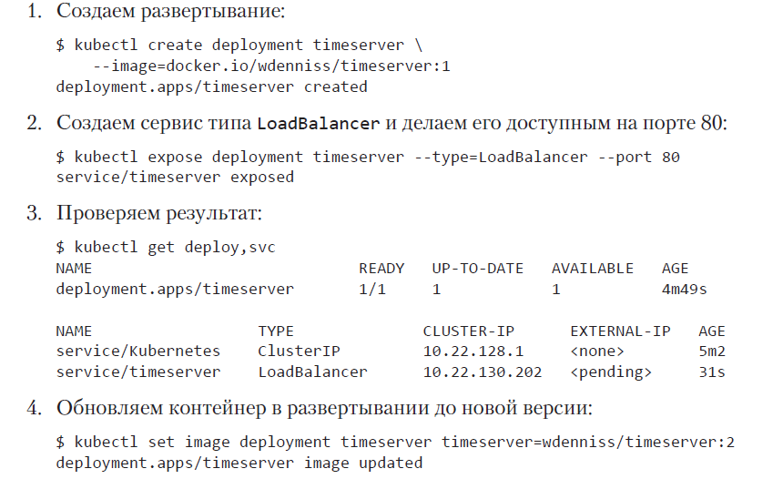

#Kubernetes

## 1. Развёртывание (Deployment)

Файл "deploy.yaml" :

```yaml
apiVersion: apps/v1
kind: Deployment
metadata:
  name: flaska
spec:
  replicas: 3
  selector:
    matchLabels:
      pod: flaska-pod
  template:
    metadata:
      labels:
        pod: flaska-pod
    spec:
      containers:
      - name: flaska-container
        image: docker.io/zkote47/hi-flask:v1
```

1) Поднимаем локальный кластер на нашей машине через minikube:
`minikube start`

2) Переходим в директорию проекта и формируем развёртывание:
`kubectl create -f deploy.yaml`

> Если вам нужно изменить этот объект после его создания (например, изменить номер версии образа), то внесите эти изменения в описание объекта в файле локально и обновите объект Deployment в кластере с помощью команды:> 
> `kubectl apply -f deploy.yaml` 

3) Проверить состояние объекта Deployment можно с помощью команды:
`kubectl get deploy`

4) Аналогично проверить поды:
`kubectl get pods`



Команда `kubectl get pods` возвращает информацию о состоянии всех подов, находящихся в активном пространстве имен; если вы используете несколько объектов Deployment, эта информация может быть немного беспорядочной. В таком случае можно использовать более многословный формат этой команды, используя в качестве *селектора метки* интересующих вас подов. Вот как выглядит этот полный вариант команды при использовании в качестве селектора метки нашего демонстрационного объекта Deployment:

`kubectl get pods --selector=pod=<pod_name>=-pod`

(<pod_name> = **flaska**, далее использую *flaska* или *timeserver* как у автора) 

Чтобы подключиться к только что созданному объекту Deployment и посетить развернутый нами сервер еще до создания публичного IP-адреса, можно просто перенаправить в контейнеры порт локальной машины:
Перенаправить порт к одному из подов развертывания можно с помощью следующей команды:

`kubectl port-forward deploy/$DEPLOYMENT_NAME $TO_PORT:$FROM_PORT`

`kubectl port-forward deploy/flaska 8080:80`

Вывод команды:

`Forwarding from 127.0.0.1:8080 -> 80`

`Forwarding from [::1]:8080 -> 80`

Благодаря этому мы сможем взаимодействовать с объектом Deployment с локальной машины, перейдя по адресу http://localhost:8080.

Откроем новое окно командной оболочки и выведем в нем логи журнала:

`kubectl logs -f deploy/flaska`

> Параметр **-f** (от follow, «продолжать») обеспечивает потоковый вывод записей журнала из одного из тех подов, которые содержит развертывание.

**Устранение неполадок** стр.97: Kubernetes для разработчиков

База:
При отладке сбойных контейнеров всегда сначала выполняем команду 

`kubectl describe pod $POD_NAME`

Чтобы разобраться в причинах сбоя, будет полезно отобразить записи журнала, созданные для предыдущего экземпляра контейнера (который работал до аварийного перезапуска), и посмотреть, какие сообщения об ошибках выводились в момент сбоя. Для этого добавьте в команду для извлечения записей журнала параметр **--previous** (или просто -p):

`kubectl logs -p $POD_NAME`

## 2. Спецификация пода

В документации по API Kubernetes шаблон объекта Pod упоминается как шаблон PodSpec. В принципе, его можно «выдернуть» из определения объекта Deployment и запустить отдельно. Для этого вам потребуется создать отдельный конфигурационный YAML-файл с заголовком, указывающим, что это объект Pod, а не объект Deployment, и скопировать на корневой уровень нового файла все элементы, расположенные ниже слова template (шаблон):



Финальная версия описания пода:

```yaml
apiVersion: v1
kind: Pod
metadata:
	name: timeserver
	labels:
		pod: timeserver-pod
spec:
	containers:
		- name: timeserver-container
		image: docker.io/wdenniss/timeserver:1
```

Так устроен объект Deployment с вложенным шаблоном PodSpec. 
При желании вы можете создать этот под напрямую, но в таком случае его жизненным циклом уже не будет управлять контроллер Kubernetes. Такие поды перезагружаются в случае сбоя, но не распределяются заново при их вытеснении вследствие наступления события обновления или отказа узла. Именно поэтому **вместо того чтобы распределять поды напрямую в отдельном файле, в большинстве случаев лучше прописывать поды через Deployment** и других. Deployment — лишь один из множества возможных способов создания подов, управления ими и взаимодействия с подами.

**Тестирование подов.**

`kubectl exec -it deploy/timeserver -- sh`

`# echo "Testing exec"`

`Testing exec`

## 3. Публикация сервиса

Помимо балансировки нагрузки, сервисы также следят за тем, какие поды в данный момент работают и могут принимать трафик. Сервис будет направлять трафик только к работающим подам. Сервисы могут использоваться и внутри кластера для обеспечения взаимодействия различных приложений (такой подход часто называют **«микросервисной архитектурой»**).
Чтобы сделать доступным в Интернете свое новое приложение, определите сервис типа **LoadBalancer** (Балансировщик нагрузки), который будет предоставлять доступ к приложению конечным пользователям. Как и в случае объекта Deployment, мы должны начать с определения конфигурационного YAML-файла.

```yaml
apiVersion: v1
kind: Service
metadata:
	name: flaska
spec:
	selector:
		pod: flaska-pod
	ports:
		- port: 80
		targetPort: 80
		protocol: TCP
	type: LoadBalancer
```

В списке портов вы можете указать, какой порт должен быть доступен пользователям сервиса (port) и на какой порт пода будет направляться этот трафик (targetPort). Использование LoadBalancer даст сервису дополнительный внешний IP-адрес, помимо внутрикластерного IP-адреса. Помимо LoadBalancer существуют другие сервисы: ClusterIP, NodePort, ExternalName, Kube-proxy и др.

Создадим в кластере Service командой:

`kubectl create -f service.yaml`

> Обратите внимание: и для создания объекта Deployment, и для создания объекта Service используется одна и та же команда (kubectl create). Четыре базовые **CRUD**-операции — создание (create), чтение (read), обновление (update) и удаление (delete) — в Kubernetes выполняются для всех объектов с помощью четырех команд kubectl: 
> `kubectl create, kubectl get, kubectl apply и kubectl delete.`

Проверим наш сервис командой:

`kubectl get service`

%% можно указать при вызове команды только тот объект Service, который вас интересует: kubectl get service $SERVICE_NAME. %%



Если в столбце External IP отображается состояние ожидания (Pending), это говорит лишь о том, что внешний IP-адрес ожидает, пока балансировщик нагрузки завершит подключение к сети. Обычно этот процесс завершается через одну-две минуты, поэтому не торопитесь считать состояние ожидания проблемой.

Можно обеспечить потоковый вывод информации обо всех изменениях состояния, добавив в нее флаг --watch/-w:

`kubectl get service -w`

Если используем реальное облако, а не minikube, то можно проверить адрес через curl.
Устранение неполадок стр. 106 книги.

___

## **4. Отслеживание объектов**
Предположим, мы обновили что-либо в нашем коде (сам код и/или тег), изменили образ, обновив Deployment через apply. Мы увидим, что Kubernetes обновляет 3 наших пода не сразу, а за раз только один или какую-то часть подов. Kubernetes по умолчанию использует «*скользящую*» стратегию обновления, чтобы приложение не стало в какой-то момент недоступным.

Вместо флага -w (--watch) можно использовать команду watch перед любой командой kubectl:

`watch kubectl get deploy`

Рекомендуется вызывать эту команду с флагом -d, который выделяет все происходящие изменения:

`watch -d kubectl get deploy`

Преимущества команды watch перед флагом: обновляет всю информацию о состоянии, дополнительно указывая, что изменилось по сравнению с предыдущим состоянием.

Отобразить конкретный deployment:

`kubectl get deploy $DEPLOYMENT_NAME`

В качестве имени интересующего вас объекта следует указать имя, указанное в начале файла развертывания в поле name раздела metadata. При желании вы также можете вывести и информацию обо всех подах определенного объекта Deployment; для этого нужно отобрать интересующий вас набор подов с помощью селектора меток:

`kubectl get pods --selector=pod=timeserver-pod`

где pod=timeserver-pod — селектор меток, указанный в определении объекта Deployment.


## **5. Удаление объектов**
Существует несколько способов удаления созданных объектов. Один из них сводится к тому, чтобы удалять объекты, указывая их тип и имя:
`kubectl delete <object_type> <object_name>`
	`kubectl delete pod timeserver`

Кроме того, вы можете удалять объекты, указывая в команде удаления соответствующий конфигурационный файл или каталог для конфигурационных файлов:

`kubectl delete -f <Directory_with_configs>`

`kubectl delete -f <Directory/config_file.yaml>`



Как и в случае с контейнерами, сущности можно заново пересобрать с помощью yaml-файлов.

Удаление кластера в облачном сервисе (не через API):
`gcloud container clusters delete $CLUSTER_NAME --region $REGION`

Пример оформления кластера без конфигурационных файлов (но лучше всё таки с ними):



Такой подход называется **императивный**, он имеет ряд минусов, из-за которых **декларированный** метод (конфиг-файлы) используется чаще. При использовании императивного подхода можно экспортировать конфигурацию кластера с помощью команды

`kubectl get –o yaml $RESOURCE_TYPE $RESOURCE_NAME`

Таким образом можно перескакивать с одного метода на другой.

Переключение между кластерами:

`kubectl config get-contexts`

`kubectl config use-context $CONTEXT`